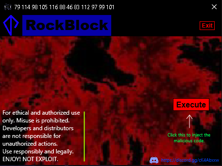

# DestroyerX

***

<Description>

**Disclaimer: Ethical Use Notice**

This tool is provided for educational purposes and ethical use. Any form of unauthorized or malicious use is strongly discouraged.

By using this tool, you agree to:

1. Use it responsibly, in compliance with all laws and regulations.

2. Refrain from any activities that could harm individuals, organizations, systems, or compromise privacy and security.

3. Accept full responsibility for any misuse or illegal actions associated with this tool.

4. Not share, distribute, or sell this tool to individuals likely to misuse it.

5. Seek proper authorization and consent for security assessments on systems not owned by you.

Your use of this tool must align with ethical and legal standards. The author/creator of this tool disclaim any responsibility for misuse or unlawful activities associated with its use.

THIS WAS CREATED TO FOR FUN.

**Screenshots:**

***

**Author: OrbitX.Space**
